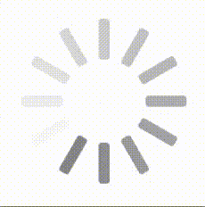
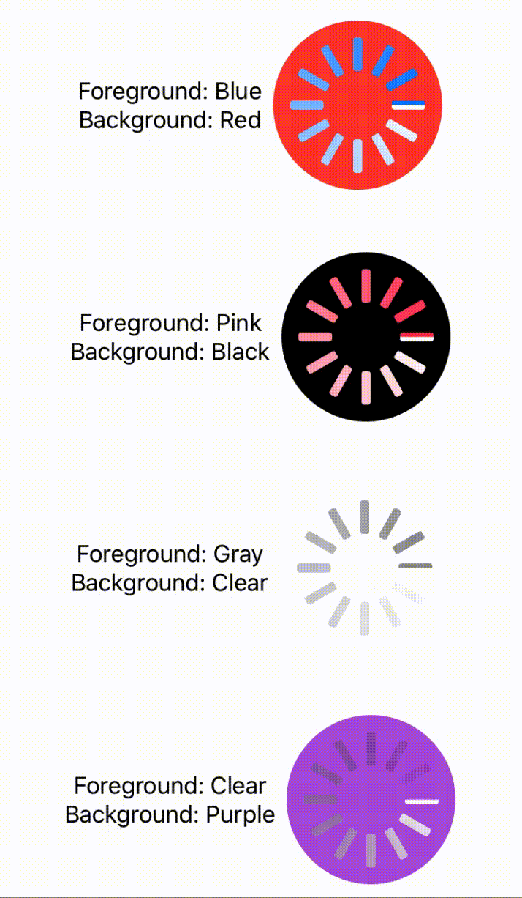

# ActivityIndicatorView


[](https://twitter.com/JoshHrach)

A SwiftUI replacement for UIActivityIndicatorView

**Note**: Apple added `ProgressView` in iOS 14. It is suggested to use this directly; `ActivityIndicatorView` is thus no longer maintained.

## Requirements

Version 1.x supports:

* Xcode 11.4+
* Swift 5.2+
* iOS 13.0+, macOS 10.15+, tvOS 13.0+, watchOS 6.0+

## Installation

Install `ActivityIndicatorView` into your project using `Swift Package Manager`.

## Usage

In your SwiftUI `.swift` file, add `import ActivityIndicatorView`.

To use, simply add the view where you would like it to appear. 

```swift
// Example view
HStack {
  // Your content
  ...
  
  // Show indicator next to your content
  ActivityIndicatorView()
}
```

### Modifier

You can easily add an activity indicator to your view similar to how you would add an `Alert` or `ActionSheet`. This will overlay an activity indicator with a maximum frame size of 50 by 50. On iOS, this will appear similar to the default size of `UIActivityIndicatorView`. When overlaid over smaller views, the activity indicator will automatically resize smaller to fit the frame.

```swift
// Examples
// Add a default indicator.
.activityIndicator(isVisible: true)

// Add a custom indicator
.activityIndicator(isVisible: true) {
    ActivityIndicatorView(foregroundColor: .green, backgroundColor: .black)
}
```

## Appearance

### Basic

You can add the view directly without customization. This will produce a view identical to `UIActivityIndicatorView`.



### Custom

You can customize the view on initialization. By specifying a `foregroundColor` and `backgroundColor`, you can adapt the view for your application.



## Support

Feel free to leave any feature requests or issues. 

## Contributing

If you'd like to contribute to improving this project, feel free to fork the project and create a pull request with your changes.

## Author

[Josh Hrach](https://github.com/JoshHrach)

[@JoshHrach](https://twitter.com/JoshHrach)
